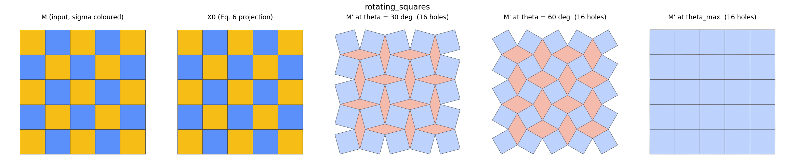
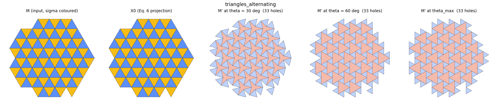
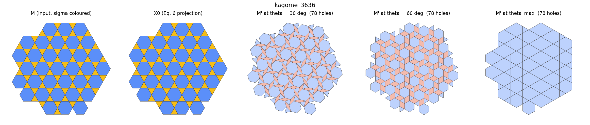
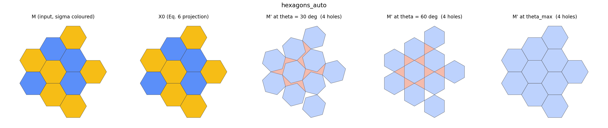
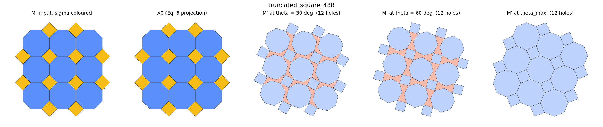
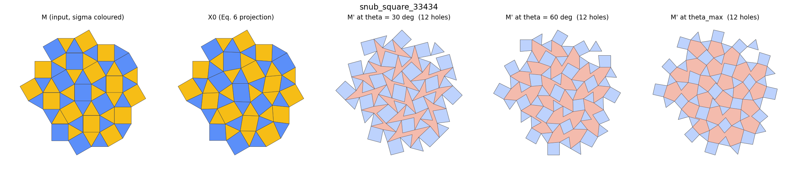
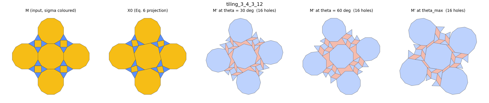
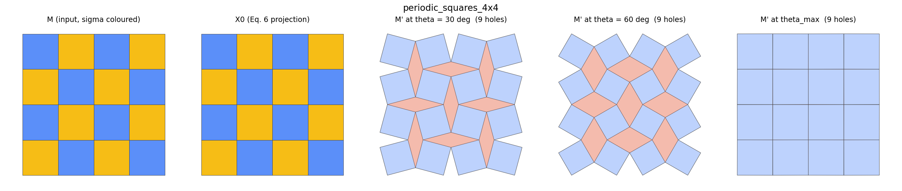

# Reference cases (Builder-Core, Phase 2 gate)

Generated by `kiri_reference`. All numbers measured, none copied from the paper.

Conventions: sigma = +1 clockwise, sigma = -1 counter-clockwise; a hinge cut keeps the
hinge at the SOURCE vertex and duplicates the TARGET (2026 Sec. 3).
`H` counts hole preimages all of whose vertices are interior; `H_geo` counts the bounded
complement components of the deployed M' traced geometrically (Definition 4.1).

| case | N | F | interior | hinge | split | H | H_geo | comps | rank(L) | dim_null | interior-H | claim | residual before | residual after | theta_max | min beta |
|---|--:|--:|--:|--:|--:|--:|--:|--:|--:|--:|--:|:--:|--:|--:|--:|--:|
| rotating_squares | 36 | 25 | 16 | 40 | 0 | 16 | 16 | 1 | 16 | 0 | 0 | OK | 0.000000 | 0.000000 | 3.141593 | 3.141593 |
| triangles_alternating | 58 | 89 | 33 | 121 | 0 | 33 | 33 | 1 | 33 | 0 | 0 | OK | 0.000000 | 0.000000 | 3.141593 | 4.188790 |
| kagome_3636 | 123 | 97 | 78 | 174 | 0 | 78 | 78 | 1 | 78 | 0 | 0 | OK | 0.000000 | 0.000000 | 3.141593 | 3.141593 |
| hexagons_auto | 33 | 10 | 9 | 13 | 5 | 4 | 4 | 1 | 4 | 5 | 5 | OK | 0.000000 | 0.000000 | 2.094397 | 2.094395 |
| truncated_square_488 | 56 | 21 | 24 | 32 | 12 | 12 | 12 | 1 | 12 | 12 | 12 | OK | 0.000000 | 0.000000 | 2.356196 | 2.356194 |
| snub_square_33434 | 50 | 53 | 25 | 64 | 13 | 12 | 12 | 1 | 12 | 13 | 13 | OK | 0.517638 | 0.000000 | 1.646137 | 3.383898 |
| tiling_3_4_3_12 | 56 | 25 | 20 | 40 | 4 | 16 | 16 | 1 | 16 | 4 | 4 | OK | 0.517638 | 0.000000 | 2.380638 | 2.380636 |
| periodic_squares_4x4 | 25 | 16 | 9 | 24 | 0 | 9 | 9 | 1 | 9 | 6 | 0 | n/a | 0.000000 | 0.000000 | 3.141593 | 3.141593 |

## Checks

| case | Remark A.1 | Alg.1 == partition | preimages partition E | split forest | geometric == combinatorial | deployable as given | theta_max after Eq. (9) | gamma |
|---|:--:|:--:|:--:|:--:|:--:|:--:|--:|--:|
| rotating_squares | OK | OK | OK | OK | OK | yes | n/a | n/a |
| triangles_alternating | OK | OK | OK | OK | OK | yes | n/a | n/a |
| kagome_3636 | OK | OK | OK | OK | OK | yes | n/a | n/a |
| hexagons_auto | OK | OK | OK | OK | OK | yes | 2.094397 | 0.010000 |
| truncated_square_488 | OK | OK | OK | OK | OK | yes | 2.356196 | inf |
| snub_square_33434 | OK | OK | OK | OK | OK | no | 1.646137 | inf |
| tiling_3_4_3_12 | OK | OK | OK | OK | OK | no | 2.415428 | 0.000100 |
| periodic_squares_4x4 | OK | OK | OK | OK | OK | yes | n/a | n/a |

## Notes and figures

Each figure shows M coloured by sigma, the Eq. (6) projection X0, and M' deployed at
30 deg, 60 deg and theta_max with the holes shaded.

- **rotating_squares**: 5x5 square grid, checkerboard sigma  
  
- **triangles_alternating**: equilateral triangle tiling, alternating sigma  
  
- **kagome_3636**: trihexagonal 3.6.3.6, alternating sigma  
  
- **hexagons_auto**: hexagonal tiling, sigma from Eq. (1); dual not 2-colourable  
  
- **truncated_square_488**: 4.8.8 truncated square, sigma from Eq. (1)  
  
- **snub_square_33434**: 3.3.4.3.4 snub square, sigma from Eq. (1)  
  
- **tiling_3_4_3_12**: 2-uniform [3.4.3.12; 3.12.12] (2026 Fig. 21): NOT deployable as the Euclidean tiling  
  
- **periodic_squares_4x4**: 4x4 periodic square tiling, Eq. (3b)-(3c)  
  
